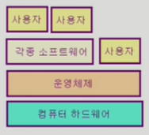
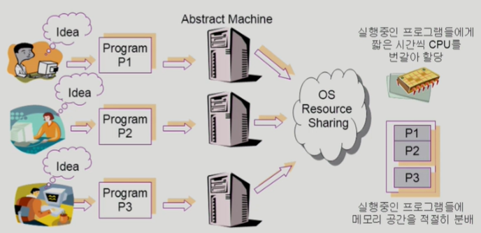
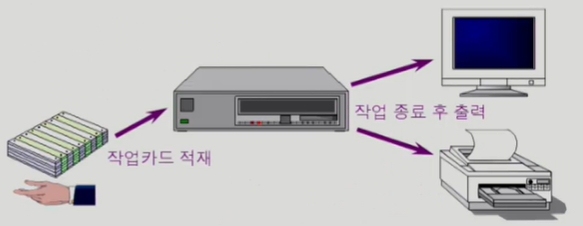
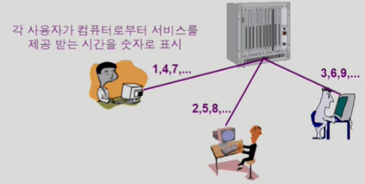
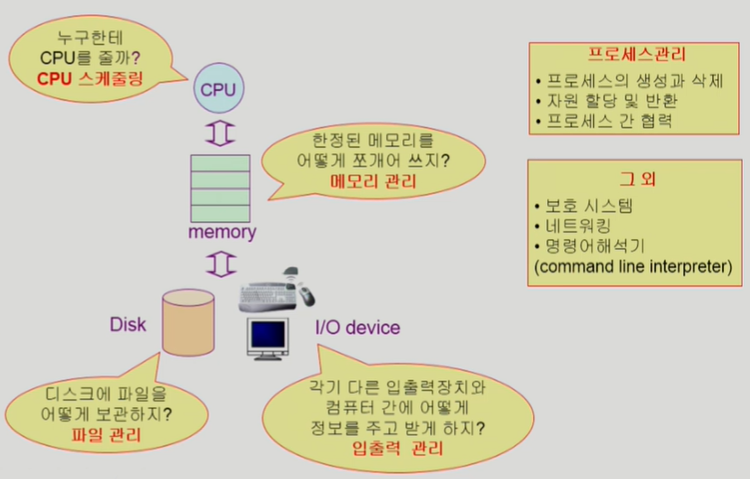

# Introduction to Operating Systems

## 운영체제란 무엇인가

운영체제(Operating System, OS)란?

- 컴퓨터 하드웨어 바로 위에 설치되어 사용자 및 다른 모든 소프트웨어와 하드웨어를 연결하는 소프트웨어 계층

- 협의의 운영체제(커널) → 좁은 의미
    - 운영체제의 핵심 부분으로 메모리에 상주하는 부분
    커널 : 컴퓨터 전원을 켠 다음(부팅된 후)에 항상 메모리에 상주
- 광의의 운영체제 → 넓은 의미; 커널 + 유틸리티
    - 커널 뿐 아니라 각종 주변 시스템 유틸리티를 포함한 개념
    - e.g.) Windows 설치하면 커널만 있는 것이 아니라 여러가지 부가적인 것들도 같이 설치
        - 부가적인 것 : 파일 복사 등의 프로그램 / 소프트웨어 (커널이 아님!)

## 운영체제의 목적

⇒ 운영체제는 하드웨어와 사용자 사이에 위치 → 그럼 어떤 역할을 할까?

컴퓨터 시스템을 편리하게 사용할 수 있는 환경 제공 → for 사용자

- 운영체제는 동시 사용자 / 프로그램들이 각각 독자적 컴퓨터에서 수행되는 것 같은 환상을 제공
- 하드웨어를 직접 다루는 복잡한 부분을 운영체제가 대행

컴퓨터 시스템의 자원을 효율적으로 관리 ⭐ → for 하드웨어 / 운영체제의 가장 중요한 목적

- 프로세서(CPU), 기억장치(Memory), 입출력 장치 등의 효율적 관리 → Resource 효율적 관리
    - 사용자 간의 형평성 있는 자원 분배
    - 주어진 자원으로 최대한의 성능을 내도록

    자원은 이미 주어져 있는 것 ⇒ 이걸 가지고 최대 성능을 내게 하는 것이 목적 (효율성 + 형평성)

- 사용자 및 운영체제 자신의 보호
- 프로세스, 파일, 메시지 등을 관리 → 소프트웨어 자원; 하드웨어 자원 뿐만 아니라 소프트웨어 자원도 관리

## 운영체제의 분류

- 동시 작업 가능 여부

    단일 작업(single tasking)

    - 한 번에 하나의 작업만 처리
    - 예) MS-DOS 프롬프트 상에서는 한 명령의 수행을 끝내기 전에 다른 명령을 수행시킬 수 없음

    다중 작업(multi tasking)

    - 동시에 두 개 이상의 작업 처리
    - 예) UNIX, MS Windows 등에서는 한 명령의 수행이 끝나기 전에 다른 명령이나 프로그램을 수행할 수 있음

- 사용자의 수

    단일 사용자(single user)

    - 예) MS-DOS, MS Windows

    다중 사용자(multi user)

    - 예) UNIX, NT server

- 처리 방식

    일괄 처리(batch processing)

    - 작업 요청의 일정량 모아서 한꺼번에 처리
    - 작업이 완전 종료될 때까지 기다려야 함
    - 예) 초기 Punch Card 처리 시스템

    

    시분할(time sharing)

    - 여러 작업을 수행할 때 컴퓨터 처리 능력을 일정한 시간 단위로 분할하여 사용
    - 일괄 처리 시스템에 비해 짧은 응답 시간을 가짐
        - 예) UNIX / 현재 우리가 쓰는 컴퓨터 생각하면 돼
    - interactive한 방식 → 내가 키보드를 눌렀을 때 바로 화면에 결과가 나타나는 것

    (정확한 시간을 지켜주는 것은 아님 / 하지만 사용자에게 바로 결과가 보인다는 느낌을 주는 것)

    

    실시간(Realtime OS)

    - 정해진 시간 안에 어떠한 일이 반드시 종료됨이 보장되어야 하는 실시간 시스템을 위한 OS

        시분할은 범용 시스템에서라면 실시간은 특정 목적을 가진 시스템에서 사용됨

    - 예) 원자로 / 공장 제어, 미사일 제어, 반도체 장비, 로보트 제어

    +)실시간 시스템의 개념 확장

    - Hard realtime system (강성 실시간 시스템) → 데드라인을 정확히 지키지 않았을 때 치명적인 결과를 초래하는 경우(e.g. 반도체 공정)
    - Soft realtime system (연성 실시간 시스템) → 데드라인을 정확히 지키지 않아도 치명적인 결과를 초래하지 않는 경우(e.g. 영화)

    ⇒ 우린 주로 시분할 운영체제를 다룰 것

### +) 몇 가지 용어

Multitasking

: 하나의 작업이 끝나기 전에 다른 작업이 동시에 실행 됨을 의미

(사실 시간을 쪼개어 한 번에 하나의 작업만 수행하고 이를 빠르게 전환해서 동시에 실행되는 것처럼 보이는 것이지만 넓은 시간대를 봤을 때 한 시간대에 여러 작업이 동시에 진행된다는 의미로 사용)

Multiprogramming

Time sharing

Multiprocess

구분

- 위의 용어들은 컴퓨터에서 여러 작업을 동시에 수행하는 것을 뜻한다
- Multiprogramming은 여러 프로그램이 메모리에 올라가 있음을 강조
- Time sharing은 CPU의 시간을 분할하여 나누어 쓴다는 의미를 강조
- ⭐Multiprocessor : 하나의 컴퓨터에 CPU(processor)가 여러 개 붙어 있음을 의미
    - 위의 3개 용어와는 약간 성격이 다름 → 위의 용어는 단일 CPU로 시간을 나누어 여러 작업을 수행한다는 의미라면, Multiprocessor는 각 CPU별로 별개의 작업을 Time sharing 없이 동시에 수행할 수 있다는 의미(=병렬)

## 운영 체제의 예

유닉스(UNIX)

- 코드의 대부분을 C언어로 작성
- 높은 이식성
- 최소한의 커널 구조
- 복잡한 시스템에 맞게 확장 용이
- 소스 코드 공개
- 프로그램 개발에 용이
- 다양한 버전
    - System V, FreeBSD, SunOS, Solaris
    - Linux

DOS(Disk Operating System)

- MS사에서 1981년 IBM-PC를 위해 개발
- 단일 사용자용 운영체제, 메모리 관리 능력의 한계(주 기억 장치 : 640KB)

MS Windows

- MS사의 다중 작업용 GUI 기반 운영 체제
- Plug and Play, 네트워크 환경 강화
- DOS용 응용 프로그램과 호환성 제공
- 불안정성
- 풍부한 지원 소프트웨어

Handheld device를 위한 OS

- PalmOS, Pocket PC(WinCE), Tiny OS

## 운영 체제의 구조

