# System Structure & Program Execution

## 컴퓨터 시스템 구조

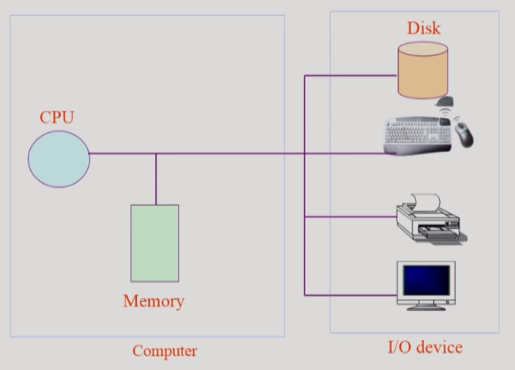

컴퓨터 : CPU + Memory

- Memory : CPU의 작업 공간
    - CPU에서 일(instruction; 기계어 실행)을 하려면 매 clock-cycle마다 memory에서 instruction(기계어)를 하나씩 읽어서 실행하게 된다.

I/O 디바이스

- Disk : 보조 기억장치라고 보통 이야기 하지만 I/O 디바이스라고 볼 수도 있다.
    - Disk의 데이터를 읽어와서 사용 → Input device 역할
    - 처리 결과를 Disk에 파일로 저장 → Output device 역할

CPU와 I/O 디바이스의 처리 속도는 큰 차이가 있음

- Disk가 CPU보다 100만 배 가량 느리다

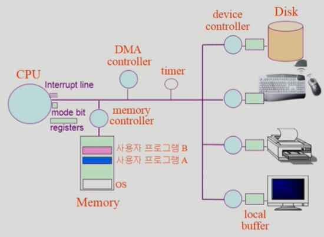

I/O 디바이스

- device controller : 각 I/O 디바이스에 있는 해당 디바이스를 전담하는 작은 cpu 같은 것
- local buffer : device controller의 작업 공간

CPU

- register : memory보다 더 빠르면서 정보를 저장할 수 있는 CPU 안에 있는 작은 공간
- mode bit : 지금 CPU에서 실행되고 있는 것이 운영체제인지 사용자 프로그램인지 구분해주는 CPU 내부 요소
- interrupt line : ...뭐라고 설명은 했는데 정리가 어렵당,,,

timer : 특정 프로그램이 CPU를 독점하는 것을 막기 위함

DMA controller : 직접 메모리에 접근할 수 있는 컨트롤러 Direct Memory Access

- 원래 메모리는 CPU만 접근할 수 있는데, DMA를 두게 되면 DMA에서도 메모리에 접근할 수 있게 됨
- I/O 처리마다 CPU에 interrupt를 걸면 너무 빈번해서 오버헤드가 큼 → DMA가 직접 memory로 작업 내용 옮겨주고 작업 완료 시 CPU에 보고하면 CPU interrupt가 줄어서 오버헤드를 줄일 수 있음

Memory controller : CPU와 DMA controller 둘이서 메모리에 동시 접근하면 문제가 생길 수 있으므로 이를 control

## Mode bit

사용자 프로그램의 잘못된 수행으로 다른 프로그램 및 운영체제에 피해가 가지 않도록 하기 위한 보호 장치 필요

**Mode bit**을 통해 하드웨어적으로 두 가지 모드의 **operation** 지원

1 사용자 모드 : 사용자 프로그램 수행
0 모니터 모드 : OS 코드 수행 (= 커널 모드, 시스템 모드)

- 보안을 해칠 수 있는 중요한 명령어는 모니터 모드에서만 수행 가능한 **'특권명령'**으로 규정
    - mode bit이 0일 때 (=모니터 모드일 때) 무슨 일이든 할 수 있게 정의되어 있다
- Interrupt나 Exception 발생 시 하드웨어가 mode bit을 0으로 바꿈
- 사용자 프로그램에게 CPU를 넘기기 전에 mode bit을 1로 세팅
    - mode bit이 1일 때 (=사용자 모드일 때) 제한된 작업만 할 수 있게 정의되어 있다

        → 보안 목적이겠지!

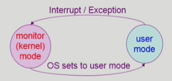

## Timer

타이머

- 정해진 시간이 흐른 뒤 운영체제에게 제어권이 넘어가도록 인터럽트를 발생시킴
- 타이머는 매 클럭 틱 때마다 1씩 감소
- 타이머 값이 0이 되면 타이머 인터럽트 발생
- CPU를 특정 프로그램이 독점하는 것으로부터 보호

타이머는 time sharing을 구현하기 위해 널리 이용됨

타이머는 현재 시간을 계산하기 위해서도 사용

## Device Controller

I/O device controller

- 해당 I/O 장치 유형을 관리하는 일종의 작은 CPU
- 제어 정보를 위해 control register, status register를 가짐
- local buffer를 가짐 (일종의 data register) → 실제 데이터를 담는 영역

I/O는 실제 device와 local buffer 사이에서 일어남

Device controller는 I/O가 끝났을 경우 interrupt로 CPU에 그 사실을 알림

> +)
device driver (장치구동기) : OS 코드 중 각 장치별 처리 루틴 → software
device controller (장치제어기) : 각 장치를 통제하는 일종의 작은 CPU → hardware

## 입출력(I/O)의 수행

모든 입출력 명령은 특권 명령 → 사용자 프로그램은 직접 I/O 할 수 없고 OS 통해서만 I/O 가능

사용자 프로그램은 어떻게 I/O를 하는가?

- 시스템콜(system call)
    - 사용자 프로그램은 운영체제에게 I/O 요청 = 운영체제한테 부탁
- trap을 사용하여 인터럽트 벡터의 특정 위치로 이동 (→ trap : 소프트웨어 인터럽트)
- 제어권이 인터럽트 벡터가 가리키는 인터럽트 서비스 루틴으로 이동
- 올바른 I/O 요청인지 확인 후 I/O 수행
- I/O 완료 시 제어권을 시스템콜 다음 명령으로 옮김

## 인터럽트 (Interrupt)

인터럽트

- 인터럽트 당한 시점의 레지스터와 program counter를 save한 후 CPU의 제어를 인터럽트 처리 루틴에 넘긴다

Interrupt (넓은 의미)

- Interrupt (하드웨어 인터럽트) : 하드웨어가 발생시킨 인터럽트 → 좁은 의미
- Trap (소프트웨어 인터럽트)
    - Exception : 프로그램이 오류를 범한 경우
    - System call : 프로그램이 커널 함수를 호출하는 경우

인터럽트 관련 용어

- 인터럽트 벡터
    - 해당 인터럽트의 처리 루틴 주소를 가지고 있음
- 인터럽트 처리 루틴 (= Interrupt Service Routine, 인터럽트 핸들러)
    - 해당 인터럽트를 처리하는 커널 함수

현대의 운영체제는 인터럽트에 의해 구동됨

## 시스템콜(System call)

시스템콜

- 사용자 프로그램이 운영체제의 서비스를 받기 위해 커널 함수를 호출하는 것

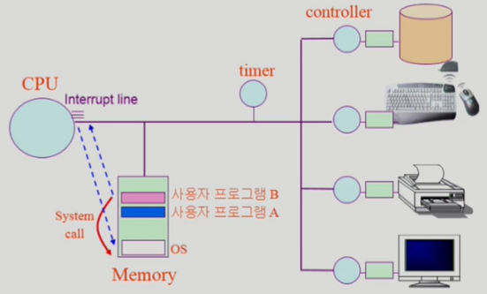

## 동기식 입출력과 비동기식 입출력

동기식 입출력 (synchronous I/O)

- I/O 요청 후 입출력 작업이 와뇨된 후에야 제어가 사용자 프로그램에 넘어감
- 구현 방법 1
    - I/O가 끝날 때까지 CPU를 낭비시킴
    - 매 시점 하나의 I/O만 일어날 수 있음
- 구현 방법 2
    - I/O가 완료될 때까지 해당 프로그램에게서 CPU를 빼앗음
    - I/O 처리를 기다리는 줄에 그 프로그램을 줄 세움
    - 다른 프로그램에게 CPU를 줌

비동기식 입출력 (asynchronous I/O)

- I/O가 시작된 후 입출력 작업이 끝나기를 기다리지 않고 제어가 사용자 프로그램에 즉시 넘어감

⭐두 경우 모두 I/O의 완료는 인터럽트로 알려줌

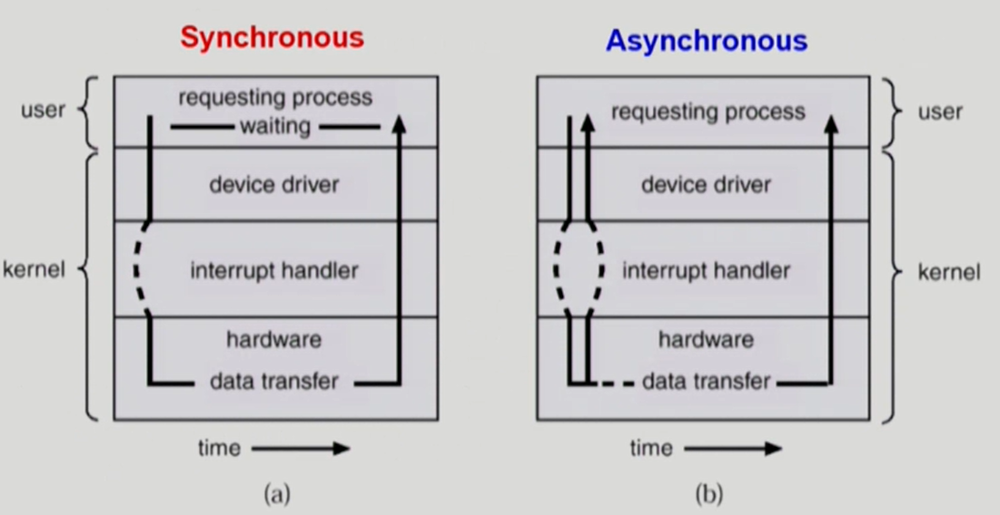

## DMA (Direct Memory Access)

DMA (Direct Memory Access)

- 빠른 입출력 장치를 메모리에 가까운 속도로 처리하기 위해 사용
    - 원래는 Memory에 CPU만 접근 가능한데, I/O 바이트 단위 처리마다 interrupt 걸리면 너무 많은 interrupt 발생하기 때문에 interrupt 빈도를 줄이기 위해 DMA 사용하여 memory에 접근하여 I/O 내용 copy하도록 함
- CPU의 중재 없이 device controller가 device의 buffer storage의 내용을 메모리에 block 단위로 직접 전송
- 바이트 단위가 아니라 block 단위로 인터럽트를 발생시킴

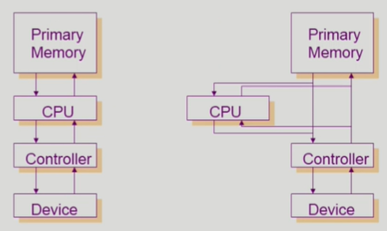

## 서로 다른 입출력 명령어

I/O를 수행하는 special instruction에 의해

Memory Mapped I/O에 의해

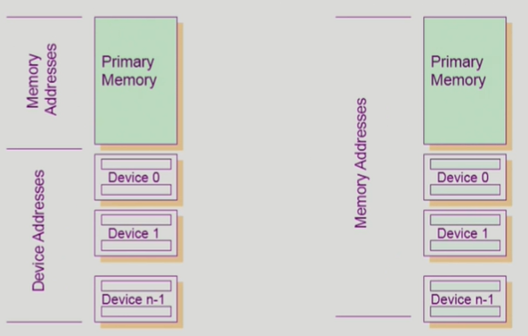

## 저장장치 계층 구조

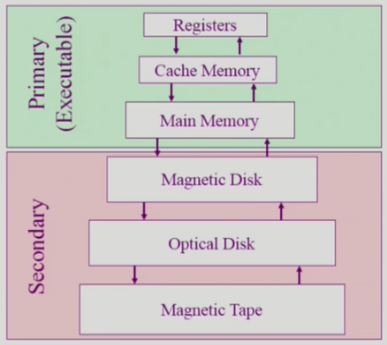

Speed : 위로 갈수록 빠른 매체 (Register는 CPU 내부 저장소)

Cost : 위로 갈수록 단위 용량 당 가격이 비쌈 → 위로 갈수록 용량이 적다

Volatility : Primary - 휘발성 / Secondary - 비휘발성

+) CPU가 직접 접근하려면 바이트 단위로 접근 가능한 매체여야 함

DRAM : 바이트 단위

Disk : 섹터 단위

⭐Caching : copying information into faster storage system

## 프로그램의 실행 (메모리 load)

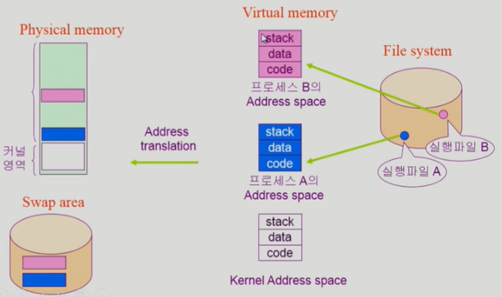

프로그램 : 하드 디스크(파일 시스템)에 파일 형태로 저장되어 있음 → 실행시키면 Memory에 올라가서 프로세스가 됨

- Virtual memory : 프로그램마다 독자적으로 가지는 주소 공간 (Address space) (프로그램 종료 후 사라짐)
    - code : 기계어 코드
    - data : 변수
    - stack : 함수 호출 관련 영역

## 커널 주소 공간의 내용

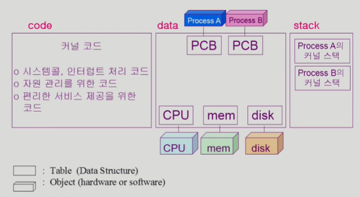

## 사용자 프로그램이 사용하는 함수

함수 (function)

- 사용자 정의 함수
    - 자신의 프로그램에서 정의한 함수
- 라이브러리 함수
    - 자신의 프로그램에서 정의하지 않고 갖다 쓴 함수
    - 자신의 프로그램의 실행 파일에 포함되어 있다
- 커널 함수
    - 운영체제 프로그램의 함수
    - 커널 함수의 호출 = 시스템 콜

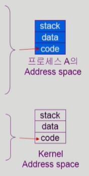

## 프로그램의 실행

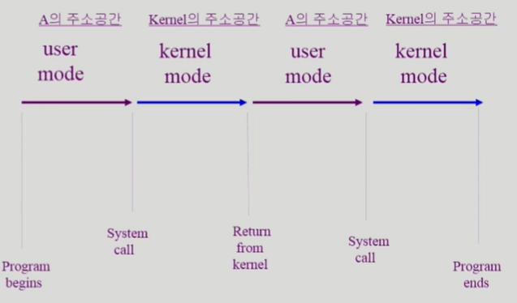