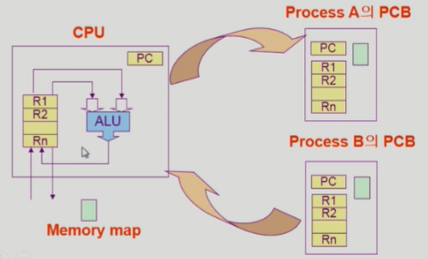

# Process

## 프로세스의 개념

"Process is a program in execution"

프로세스의 문맥(context) → 특정 시점을 놓고 봤을 때, 이 프로세스가 어디까지 수행했는지, 무슨 내용을 어디까지 쌓아놓고 있는지 등의 상태

- CPU 수행 상태를 나타내는 하드웨어 문맥
    - Program Counter
    - 각종 register
- 프로세스의 주소 공간
    - code, data, stack
- 프로세스 관련 커널 자료 구조
    - PCB (Process Control Block)
    - Kernel stack
    - 커널 = 여러 프로세스들이 공유하는 코드 라고 볼 수 있음

## 프로세스의 상태 (Process State)

프로세스는 상태(state)가 변경되며 수행된다

- Running
    - CPU를 잡고 instruction을 수행 중인 상태
    - 컴퓨터 안에 CPU는 1개 → CPU를 잡고 있는 프로세스는 매 순간 1개 → 이 프로세스의 상태가 바로 Running
- Ready
    - CPU를 기다리는 상태 (메모리 등 다른 조건을 모두 만족하고)
    - 물리적인 메모리에 올라가있는 상태여야겠지!
    - Ready 상태의 프로세스들이 CPU를 번갈아가며 잡았다 놨다 하며 time sharing
- Blocked (wait, sleep)
    - CPU를 주어도 당장 instruction을 수행할 수 없는 상태
    - Process 자신이 요청한 event(예 : I/O)가 즉시 만족되지 않아 이를 기다리는 상태
    = I/O 등의 event를 (스스로) 기다리는 상태
    - (예) 디스크에서 file을 읽어와야 하는 경우
- Suspended (stopped)
    - 외부적인 이유로 프로세스의 수행이 정지된 상태
    - 프로세스는 통째로 디스크에 swap out 된다
    - (예) 사용자가 프로그램을 일시 정지 시킨 경우 (break key)
    → 시스템이 여러 이유로 프로세스를 잠시 중단 시킴 (메모리에 너무 많은 프로세스가 올라와 있을 때)
- New : 프로세스가 생성 중인 상태
- Terminated : 수행(execution)이 끝난 상태
    - 이미 종료 됐다면 프로세스가 아님 → Terminated는 수행이 끝났지만 정리할 것이 남은 상태

⭐ Blocked : 자신이 요청한 event가 만족되면 Ready

⭐ Suspended : 외부에서 resume해 주어야 Active

## 프로세스 상태도

- Running (monitor mode) : 사용자 프로세스가 커널 모드에서 running 하고 있다는 것이지 운영체제가 running 한다는 표현은 하지 않음

## Process Control Block (PCB)

PCB

- 운영체제가 각 프로세스를 관리하기 위해 프로세스당 유지하는 정보
- 프로세스 1개 당 PCB 1개

- 다음의 구성 요소를 가진다 (구조체로 유지)
    1. OS가 관리상 사용하는 정보
        - Process state, Process ID
        - scheduling information, priority
    2. CPU 수행 관련 하드웨어 값
        - Program counter, registers
    3. 메모리 관련
        - code, data, stack의 위치 정보
    4. 파일 관련
        - Open file descriptors...

## 문맥 교환 (Context Switch)

CPU를 한 프로세스에서 다른 프로세스로 넘겨주는 과정

CPU가 다른 프로세스에게 넘어갈 때 운영체제는 다음을 수행

- CPU를 내어주는 프로세스의 상태를 그 프로세스 PCB에 저장
- CPU를 새롭게 얻는 프로세스의 상태를 PCB에서 읽어옴

한 프로세스가 계속 CPU를 장악하여 쓰는 것 아님 → 짧은 시간 간격으로 CPU를 얻었다가 뺏겼다가 하는 과정을 반복

⇒ CPU를 뺏겼다가 다시 얻었을 때 처음부터 다시 실행하는 것이 아니라 뺏겼던 시점의 문맥을 기억해뒀다가 그 시점부터 다시 실행할 수 있게 하는 매커니즘이 바로 문맥 교환 

System call이나 Interrupt 발생 시 반드시 context switch가 일어나는 것은 아님

→ 사용자 프로세스로부터 운영체제로 넘어가는 것은 context switch가 아님

→ 사용자 프로세스로부터 또다른 사용자 프로세스로 넘어가는 것이 context switch

⭐ (1)의 경우에도 CPU 수행 정보 등 context의 일부를 PCB에 save해야 하지만, 문맥 교환을 하는 (2)의 경우 그 부담이 훨씬 큼 (e.g. cache memory flush)

## 프로세스를 스케줄링하기 위한 큐

Job queue

- 현재 시스템 내에 있는 모든 프로세스의 집합

Ready queue

- 현재 메모리 내에 있으면서 CPU를 잡아서 실행되기를 기다리는 프로세스의 집합

Device queues

- I/O device의 처리를 기다리는 프로세스의 집합

프로세스들은 각 큐들을 오가며 수행된다

## Ready Queue와 다양한 Device Queue

## 프로세스 스케줄링 큐의 모습

## 스케줄러 (Scheduler)

Long-term scheduler (장기 스케줄러 or job scheduler)

- 시작 프로세스 중 어떤 것들을 ready queue로 보낼 지 결정
- 프로세스에 memory(및 각종 자원)을 주는 문제
- degree of Multiprogramming을 제어
    - 메모리에 너무 많은 프로그램이 동시에 올라가 있으면 성능 저하 (각 프로그램들이 조금씩 일부만 메모리에 올라가 있어 프로그램 전체 실행이 어렵기 때문) → 동시에 몇 개의 프로그램을 메모리에 올려 놓을지 결정하는 것이 장기 스케줄러의 degree of multiprogramming 제어
- time sharing system에는 보통 장기 스케줄러가 없음 (무조건 ready)
    - Medium-term scheduler 이용해서 메모리 줄 프로그램 결정

Short-term scheduler (단기 스케줄러 or CPU scheduler)

- 어떤 프로세스를 다음 번에 running 시킬 지 결정
- 프로세스에 CPU를 주는 문제
- 충분히 빨라야 함 (millisecond 단위)

Medium-term Scheduler (중기 스케줄러 or Swapper)

- 여유 공간 마련을 위해 프로세스를 통째로 메모리에서 디스크로 쫓아냄
    - Suspended와 관련
- 프로세스에게서 memory를 뺏는 문제
- degree of Multiprogramming을 제어

## Thread

"A thread (or lightweight process) is a basic unit of CPU utilization" → CPU 수행 단위

Thread의 구성

- program counter
- register set
- stack space

Thread가 동료 thread와 공유하는 부분 (= task)

- code section
- data section
- OS resources

전통적인 개념의 heavyweight process는 하나의 thread를 가지고 있는 task로 볼 수 있다.

동일한 일을 여러 개 하는 프로세스가 있다고 하면 여러 프로세스를 만들기 위해서 메모리 공간 여러 개 생성 → 메모리 낭비

⇒ 메모리 공간 하나만 띄워 놓고 현재 각 프로세스 마다 다른 부분의 코드를 실행할 수 있게 하면 된다 (code의 어느 부분을 실행 중인지 program counter = cpu 수행 단위만 각자 가지면 됨)

⇒ Thread 개념

다중 스레드로 구성된 태스크 구조에서는 하나의 서버 스레드가 blocked(waiting) 상태인 동안에도 동일한 태스크 내의 다른 스레드가 실행(running)되어 빠른 처리를 할 수 있다.

- 예) 웹 브라우저에 네이버 보기 → 네트워크 통해 웹 페이지 읽어옴 (= I/O) → blocked
⇒ 하나의 스레드는 이미지 불러오고 또 다른 스레드는 이미 읽어온 텍스트를 화면에 뿌려주면 사용자는 결과를 빨리 볼 수 있음

동일한 일을 수행하는 다중 스레드가 협력하여 높은 처리율(throughput)과 성능 향상을 얻을 수 있다

- 자원 절약 가능

스레드를 사용하면 병렬성을 높일 수 있다

- CPU 여러 개 달린 컴퓨터에서만 얻을 수 있는 이점

- 프로세스는 하나 → PCB도 하나만 만들어진다
    - 하나의 PCB 안에서 스레드마다 CPU 관련 정보(program counter, register)만 각자 가지고 있음

## Benefits of Threads

***Responsiveness***

- e.g.) multi-threaded Web - if one thread is blocked (e.g. network), another thread continues (e.g. display)
- 응답성 (사용자 입장에서 빠름) - 웹 브라우저가 스레드를 여러 개 가지고 있으면, 하나의 스레드가 멀리 있는 서버에서 그림을 가져오는 중에 다른 스레드가 이미 읽어온 html 문서를 먼저 보여주면 blocked 상태보다 더 빠름

***Resource Sharing***

- N threads can share binary code, data, resource of the process
- 자원 공유 - 효율적

***Economy***

- *creating* & *CPU switching* thread (rather than a *process*)
- Solaris의 경우 위 두 가지 overhead가 각각 30배, 5배

***Utilization of MP Architectures***

- *each thread* may be running in *parallel* on a *different processor*

## Implementation of Threads

Some are supported by *kernel* ⇒ *Kernel Threads*

- Windows 95/98/NT
- Solaris
- Digital UNIX, Mach

: 스레드가 여러 개 있다는 사실을 운영체제 커널이 알고 있음

→ 하나의 스레드에서 다른 스레드로 CPU가 넘어갈 때 커널이 CPU 스케줄링 하듯이 넘겨줌

Others are supported by *library* ⇒ *User Threads*

- POSIX *Pthreads*
- Mach *C-threads*
- Solaris *threads*

: 스레드가 여러 개 있다는 사실을 운영체제는 모름 (라이브러리의 지원을 받아 유저 프로그램이 스스로 관리)

Some are real-time threads